# Find My Mines — architecture and diagrams

This guide explains the project for a course review: what runs where, how players
communicate, where data is stored, how AI is connected, and how the hosted version
is deployed. GitHub renders the Mermaid diagrams below directly. The matching
[visual edition](./diagrams/architecture.html) is a single HTML file: download it
and open it in a browser. GitHub's file viewer displays HTML source rather than
executing the page.

**Documentation snapshot:** 2026-10-09; local package version `4.1.0`. The code and
tracked configuration establish application behavior. Hosting topology comes from
[DEPLOY.md](../DEPLOY.md), [deployment instructions](../deploy/README.md), and the
[roadmap](../ROADMAP.md). This guide is not a fresh inspection of cloud resources:
enabled OAuth providers, deployed revision, applied database migrations, DNS records,
and cloud account settings must be checked separately when presenting live state.

## 1. Whole-system overview

Find My Mines is a real-time mine-hunting game. The multiplayer server decides the
board, valid moves, scores, turns, and results. React displays the public state and
sends player intentions over Socket.IO. Supabase supplies accounts and persistent
data; optional model APIs assist computer opponents and the review coach.

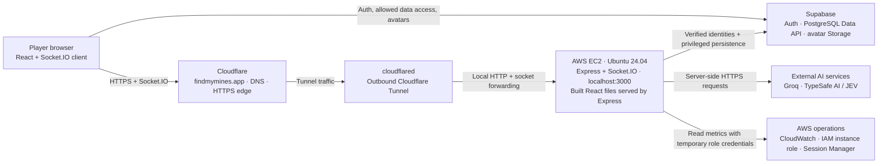

The browser downloads the frontend from the Node server, then executes React on
the user's device. Frontend and multiplayer backend share one public origin in
the documented EC2 setup. The browser also talks **directly to Supabase** for auth,
public reads, and narrowly permitted personal updates; those calls do not pass
through the game server. Groq and JEV requests originate on the server.

The documented host is a single EC2 instance in Sydney (`ap-southeast-2`), described
in the roadmap as `t4g.small`. Cloudflare handles the domain/DNS and public HTTPS
entry point; `cloudflared` on EC2 establishes the tunnel outward. Public web traffic
does not require an inbound EC2 HTTP/HTTPS port. The tunnel target is local HTTP,
not another public HTTPS endpoint. Exact tunnel IDs, DNS targets, security-group
rules, and account identifiers are not stored in this guide.

**Sources:** [server entry point](../packages/server/src/index.ts),
[socket client](../packages/client/src/socket.ts), [hosting](../DEPLOY.md),
[environment contract](../.env.example).

## 2. Application structure and feature ownership

The repository is an npm workspace with three TypeScript packages. The shared
package is imported by both sides; it is code reuse, not a fourth network service.

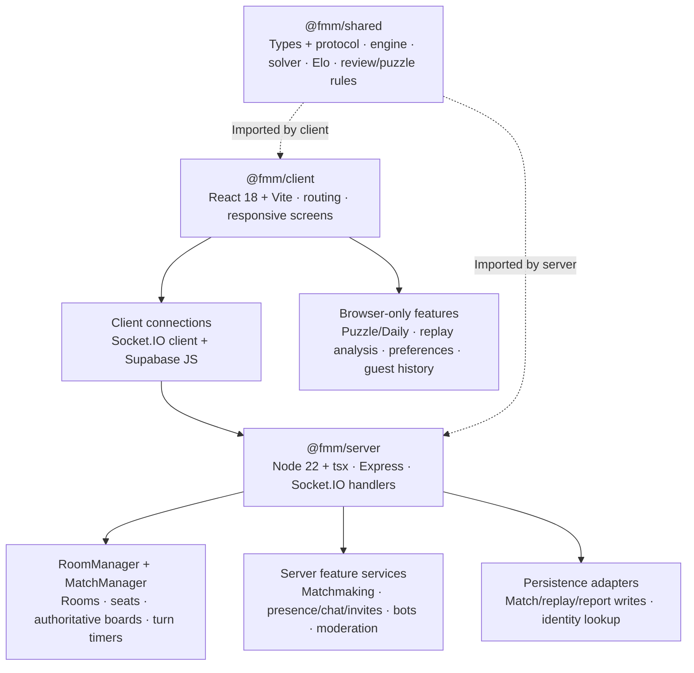

| Feature | Browser responsibility | Server / external responsibility |
|---|---|---|
| Lobby and online list | Nickname/sign-in, room cards, online players | Client registry, safe public presence, lobby broadcasts |
| Classic/custom rooms | Create/join UI, share links, join requests | Room membership, host transfer, private-room listing, bans, capacity |
| Multiplayer and spectating | Board, score, turn clock, result/rematch UI | Hidden board, move validation, 10-second Classic turns, scores, spectators, rematch votes |
| Casual/ranked matchmaking | Join/leave queue and display status | Queue pairing; registered ranked results and Elo persistence |
| Friends and profiles | Search/cards, requests, pictures, statistics, head-to-head reads | Supabase RLS; server verifies friendship before relaying live invites |
| Chat and reports | Room/world chat, invites, report form | Sanitization/rate limits, server-stamped report identities, admin handling |
| Play vs computer | AI/Fruit Fly/JEV and difficulty selection | BotController, solver or fly circuit, optional model requests |
| Hints and review | Hint display/Why toggle, replay navigation and move analysis | Solver hint, optional Groq wording, completed replay and bounded coach |
| Puzzle and Daily | Complete single-player engine, local records, deterministic Bangkok-day challenge | No gameplay socket, database, or model API required |
| Sound, haptics, theme | Web Audio synthesis, supported device vibration, preferences, responsive layouts | No audio service |
| Administration | `/admin` console, game log/viewer, reports, metrics | Separate authorized socket namespace, moderation, stats and service checks |
| Shared links/policy pages | `/join/CODE`, `/u/NAME`, `/privacy`, `/security`, `/terms` | Express SPA fallback; escaped room/profile metadata for link previews |

Main pages: `/`, `/profile`, `/u/<username>`, `/ranks`, `/puzzle`, `/review/latest`,
`/review/<matchId>`, and `/admin`. Game history is an admin tab and profile content;
`/games` is no longer a separate player page. Screens use a small History API router.

**Sources:** [router](../packages/client/src/router.tsx),
[client state](../packages/client/src/useGame.ts),
[rooms](../packages/server/src/rooms/roomManager.ts),
[shared protocol](../packages/shared/src/protocol.ts),
[Puzzle screen](../packages/client/src/screens/PuzzleScreen.tsx).

## 3. A multiplayer move, from click to saved result

Socket.IO runs on the same HTTP server as Express. It supports WebSocket and HTTP
polling; it is a typed event/ack protocol rather than a REST endpoint per move.
Each game has a Socket.IO room, so gameplay updates reach that room's players and
spectators. Lobby and public presence updates are broader broadcasts.

```mermaid
sequenceDiagram
    participant P as Player browser
    participant S as Socket.IO handlers
    participant M as MatchManager + engine
    participant D as Supabase
    P->>S: game:reveal {row, col}
    S->>M: Resolve this socket's room; reveal(playerId, row, col)
    M->>M: Check playing state, current turn, bounds, covered cell
    M-->>S: Revealed cell + public state
    S-->>P: cell:revealed (room-scoped broadcast)
    Note over P,M: A mine adds a point and keeps the turn; an empty cell passes it.
    Note over P,M: Classic timer does not reset for each mine; timeout passes the turn.
    opt Match completed or forfeited
        M-->>S: Final result + completed replay
        S-->>P: match:ended / match:forfeit, then match:replay
        S->>D: Best-effort matches, match_players, ranked rating RPC
        D-->>S: Saved match id or failure
        S-->>P: match:recorded only after successful match save
    end
```

Invalid moves receive `error:msg` and do not reveal a cell. The public game state
contains revealed cells, scores, membership and the clock; it excludes unrevealed
mine locations. Completed replays **do** contain mines and moves, but are shared
only after completion/forfeit. Authorized admins have a separate privileged game
viewer with an explicit mine-display control.

A dropped player's seat is held for 30 seconds using the tab's session ID and
server identity checks. A reconnect can resume that seat; expiry handles departure
or forfeit. A second tab has a separate seat identity. A process restart loses live
games and these reconnect holds.

Persistence happens after players see the result. Match writes have bounded retry
and replay-column fallback, but match, player rows, and rating RPCs are separate
operations rather than one atomic database transaction. A database failure can
therefore leave incomplete history or unsaved ratings. No durable retry queue is
implemented. Casual/bot games do not update official ranked Elo. Guests remain 800
to server matchmaking; their browser's unofficial rating is not trusted by the server.

**Sources:** [match manager](../packages/server/src/match/matchManager.ts),
[turn timer](../packages/server/src/match/turnTimer.ts),
[match recorder](../packages/server/src/persistence/matchRecorder.ts),
[seat holds](../packages/server/src/state/seatHold.ts).

## 4. Accounts, OAuth and socket identity

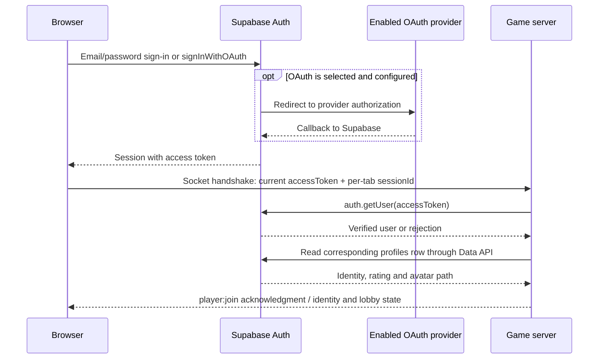

The shared Supabase participant above represents its Auth and Data API interfaces;
the profile lookup uses the Data API, not an Auth table request. An Auth signup
trigger creates `public.profiles` from `auth.users`. The game server verifies the
token instead of trusting browser-supplied account IDs or ratings. Missing,
invalid, expired, or unavailable account lookup degrades gameplay to guest mode.

OAuth buttons depend on `VITE_OAUTH_PROVIDERS` and the Supabase/provider dashboard
configuration. The repository describes GitHub sign-in as set up; Google setup has
pending/stale roadmap notes, so its current enablement is **not established here**.
Provider callbacks return to Supabase; Supabase's allowed site/redirect URLs then
return the player to the game domain. No OAuth client secret belongs in the bundle.

Browser identity has three different purposes: Supabase session for an account,
`fmm_guest` cookie for a remembered guest (30 days), and `fmm.session` in
sessionStorage for a particular tab's reconnect. A guest cookie does not confer
admin access or an official rating.

**Sources:** [auth client](../packages/client/src/auth/supabase.ts),
[handshake helper](../packages/client/src/auth/session.ts),
[server verification](../packages/server/src/supabase.ts),
[guest cookie](../packages/client/src/data/guestCookie.ts).

## 5. Database and avatar storage

The database is Supabase-managed PostgreSQL. Application access uses Supabase JS
over the Auth/Data/Storage APIs, not a raw PostgreSQL connection from the browser.
Six tracked SQL migrations define six public tables, a leaderboard view, policies,
triggers and a replay extension. The diagrams show the logical relationships;
the SQL files remain the physical schema source of truth.

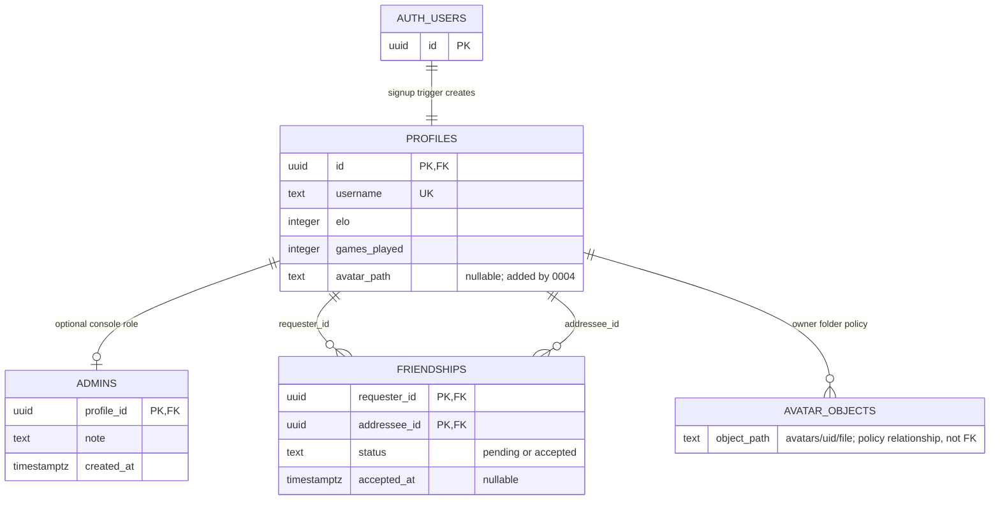

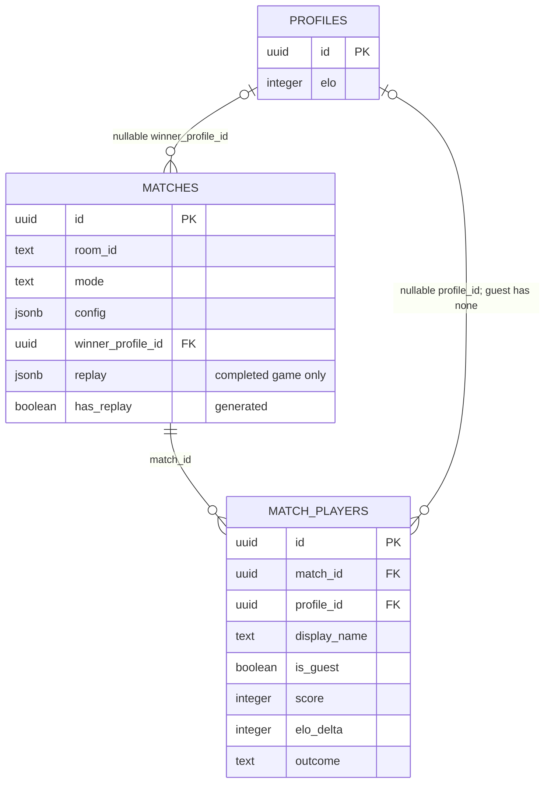

Reports are independent rows. `reporter` and `target` are JSON snapshots containing
the server-observed account/guest/session/address identity; they are **not foreign
keys** to profiles. Similarly, live room IDs are strings, not references to a
persisted rooms table. `leaderboard` is a `security_invoker` view of profiles, not
another table. Avatar ownership/path is enforced by storage policies and a profile
CHECK constraint, not an FK between profiles and storage objects.

| Object | Complete application column inventory / purpose |
|---|---|
| `public.profiles` | `id`, `username`, `elo`, `games_played`, `wins`, `losses`, `draws`, `created_at`, `updated_at`, `avatar_path` |
| `public.matches` | `id`, `room_id`, `mode`, `config`, `winner_profile_id`, `created_at`, `replay`, generated `has_replay` |
| `public.match_players` | `id`, `match_id`, nullable `profile_id`, `display_name`, `is_guest`, `score`, `placement`, `elo_before`, `elo_after`, `elo_delta`, `outcome` |
| `public.admins` | `profile_id`, `note`, `created_at`; server-only admin allowlist |
| `public.friendships` | Composite PK `requester_id` + `addressee_id`, `status`, `created_at`, `accepted_at`; unique unordered account pair |
| `public.reports` | `id`, `created_at`, `reason`, `details`, `room_id`, `status`, `handled_at`, `reporter`, `target`; server-only, 90-day retention |
| `public.leaderboard` | Profile identity, rating, ranked counters, computed `rank`, and `avatar_path`; profiles with ranked games |
| `auth.users` | Supabase-managed account records; profile `id` references this ID |
| `storage.buckets` / `storage.objects` | Supabase-managed storage metadata; public `avatars` bucket with per-user folders |

The avatar bucket accepts WebP, PNG or JPEG up to 2 MB. Signed-in owners can upload,
replace/list/delete within their own folder and update their own `avatar_path`.
Pictures are publicly readable by URL. No SVG uploads are permitted by the bucket.
Replays are JSONB under a 100,000-byte size check, not one row per move.

### Who can read and write?

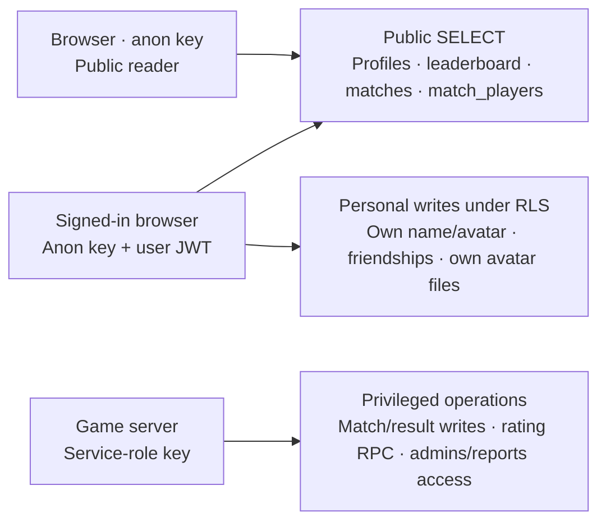

All public tables enable row-level security. Browser access also depends on SQL
grants, permitted columns, CHECK constraints and triggers. The rating-protection
trigger prevents ordinary users changing rating counters; `apply_match_result`
is callable only by `service_role`. `admins` and `reports` have no browser grants
or policies. Friendships allow participants to read and narrowly transition a
request from pending to accepted. Supabase's server service-role key bypasses RLS,
so server handlers must still validate identity, membership and permissions.

**Schema sources:** [0001 accounts/Elo](../supabase/migrations/0001_accounts_and_elo.sql),
[0002 admins](../supabase/migrations/0002_admins.sql),
[0003 friends](../supabase/migrations/0003_friends.sql),
[0004 avatars](../supabase/migrations/0004_avatars.sql),
[0005 reports](../supabase/migrations/0005_reports.sql),
[0006 replays](../supabase/migrations/0006_match_replays.sql).

## 6. AI, hints and review coach

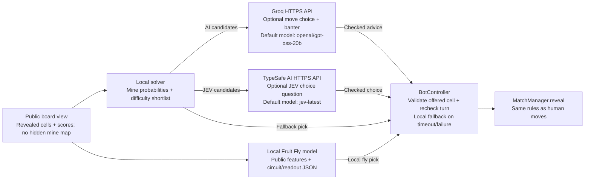

| Path | Actual connection and behavior |
|---|---|
| AI opponent | Server `fetch` to `https://api.groq.com/openai/v1/chat/completions`, bearer `GROQ_API_KEY`; public board/score context and solver candidates; model set by `AI_MODEL` |
| JEV opponent | Server `fetch` to `https://api.typesafe.ai/v1/systemone`, `JEV_API_KEY`; a `choice` question over solver candidates; model set by `JEV_MODEL`; no Groq picker in this branch |
| Fruit Fly opponent | Local inference from bundled `circuit.json` and `readout.json`; no runtime neuPrint request; Groq can supply optional banter but cannot replace the fly's chosen move |
| Multiplayer AI hint | Server solver returns a mine hint and factual explanation immediately; optional Groq rewording follows as `ai:hintWhy` and must pass validation/staleness checks |
| Puzzle hint | Browser solver chooses a safe cell and explains it locally; no Groq call |
| Review coach | Server obtains its own completed replay, computes review facts, then calls Groq with the question and bounded chat context; client-supplied replay facts are not trusted |

The Groq endpoint is OpenAI-compatible. `openai/gpt-oss-20b` is a model identifier;
the project does **not** call the OpenAI API directly. Neither AWS Bedrock nor a
full-brain GPU service is implemented in the runtime; roadmap mentions are future
ideas. API keys stay on the server and never use a `VITE_` prefix.

Groq's application budget is 20 calls / 6,000 tokens per minute per advisor instance;
JEV's is 30 calls per minute. Bot requests wait up to 4 seconds within the remaining
turn budget, then use the local pick. Outputs must name an offered, covered cell;
the server rechecks that the same bot turn is still active after awaiting the API.
429/backpressure pauses requests. No Groq key means solver-only AI; no JEV key means
JEV is unavailable. A failed fly model load/inference falls back to the solver.

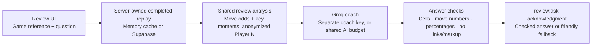

The coach has an 8-second timeout, 10 accepted questions per person per game and a
3-second question gap; availability lookups are rate limited too. Facts are bounded
to 5,000 characters. `GROQ_COACH_API_KEY` gives the coach an independent advisor;
otherwise it shares the AI key with half the minute reserved for opponents. With
no Groq key, the coach is off. Coach context is kept in server memory, not persisted
by this application; the question and game facts are nevertheless sent to Groq.

**Sources:** [bot controller](../packages/server/src/ai/botController.ts),
[Groq adapter](../packages/server/src/ai/advisor.ts),
[JEV adapter](../packages/server/src/ai/jev.ts),
[solver](../packages/shared/src/engine/solver.ts),
[hint validation](../packages/server/src/ai/hintReword.ts),
[coach](../packages/server/src/ai/coach.ts).

## 7. Fruit Fly: offline provenance versus runtime inference

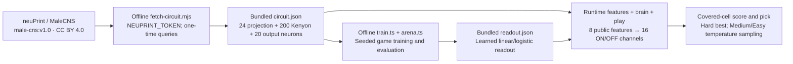

The wiring is a small connectome-derived circuit; the neuron simulation and trained
readout are implemented locally. It is not a complete living fly simulation or a
runtime GPU service. The offline dataset/token is unnecessary for ordinary play.
Runtime features describe visible neighbors, discovered mines, edges and remaining
mine density. Difficulty changes temperature/sampling, not access to hidden answers.
Dataset credit is carried in the bundled circuit and shown in the opponent's About UI.

**Sources:** [fetch script](../scripts/fly/fetch-circuit.mjs),
[training](../scripts/fly/train.ts), [arena](../scripts/fly/arena.ts),
[features](../packages/server/src/ai/fly/features.ts),
[brain](../packages/server/src/ai/fly/brain.ts),
[runtime picker](../packages/server/src/ai/fly/play.ts).

## 8. Data lifetime: memory, browser storage and database

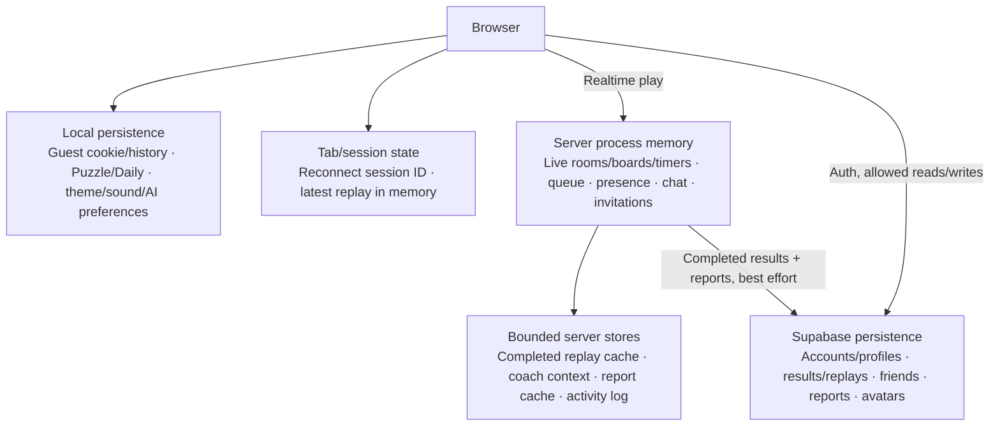

| Lifetime | What to explain |
|---|---|
| Live server process | Rooms, concealed boards, scores/timers, matchmaking, online status, requests/invites and room chat are not database-backed live sessions. Restart loses them. |
| Recent server caches | Replays: at most 200, expiring after 2 hours without use. World chat has a bounded recent in-memory feed. Coach exchanges, request budgets and admin activity logs are ephemeral. |
| Browser guest storage | Guest cookie and locally retained guest history use a 30-day window. Unofficial Elo is browser-side. Clearing site data loses them. |
| Browser Puzzle/Daily | Best times, Daily attempts/streaks and saved Daily progress use localStorage. Daily records are pruned around a 400-day window; no shared Daily leaderboard. |
| Tab state | `fmm.session` is in sessionStorage. Latest finished replay is held in browser memory, so `/review/latest` cannot survive a full reload solely from that copy. |
| Supabase | Accounts, profiles, friends, completed match/player rows, saved replays, report rows and avatar objects survive an app restart. Reports are pruned after 90 days at startup and daily. |

The application can play multiplayer as guests without Supabase credentials, and
AI can use local picks without external keys. Persistent profile/history/social
features depend on Supabase. Live multiplayer depends on the one running server.

**Sources:** [server state stores](../packages/server/src/state),
[guest history](../packages/client/src/data/guestHistory.ts),
[Daily storage](../packages/client/src/data/dailyStore.ts),
[Puzzle storage](../packages/client/src/data/puzzleStore.ts),
[latest replay](../packages/client/src/data/latestReplay.ts).

## 9. Admin access, monitoring and remote maintenance

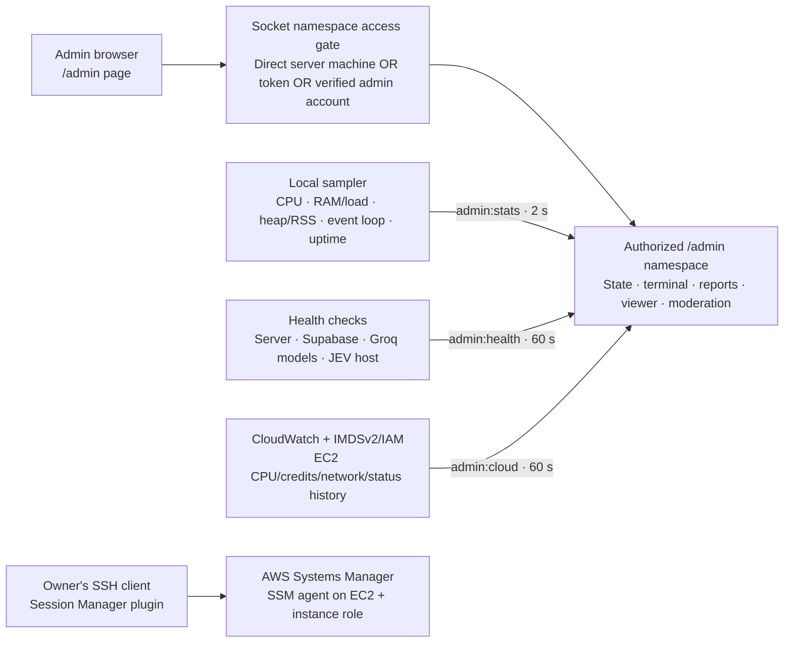

The `/admin` **page route** is React UI; the Socket.IO `/admin` **namespace** is the
protected backend channel. Merely loading the page does not grant access. The gate
accepts a direct connection from the server machine, a configured `ADMIN_TOKEN`,
or a verified Supabase user listed in `public.admins`. Forwarding headers disable
the server-machine shortcut, so Cloudflare visitors cannot gain access merely
because `cloudflared` connects from loopback. Client addresses extracted from
forwarded headers are for display/reports, not an authorization decision.

Admins can reset matches, kick/ban clients, close rooms, clear world chat, handle
reports and watch games. The terminal is an application activity feed, not a remote
shell. Server-local telemetry is sampled every 2 seconds while an authorized console
is open; service and CloudWatch collectors run every minute and stop when the last
console disconnects. Service reachability does not prove a model inference works.

CloudWatch collects CPUUtilization, CPUCreditBalance, CPUCreditUsage, NetworkIn,
NetworkOut and StatusCheckFailed at five-minute resolution, with up to 24 hours of
history. IMDSv2 identifies the instance/region; the AWS SDK obtains temporary
instance-role credentials. Documented IAM permissions include
`cloudwatch:GetMetricStatistics`, `cloudwatch:ListMetrics`, and
`AmazonSSMManagedInstanceCore` for Session Manager. No AWS access keys belong in
the app `.env`. Missing AWS metadata/credentials/permissions leave an unavailable
card rather than breaking the game. No application-created CloudWatch alarm or
dashboard is implemented.

Owner maintenance is through SSH over AWS Systems Manager Session Manager, with
EC2 Instance Connect retained as a documented alternative. This is independent
of the web admin console. The current security-group rule inventory is not freshly
verified in this guide.

**Sources:** [access gate](../packages/server/src/admin/access.ts),
[admin handlers](../packages/server/src/admin/adminNamespace.ts),
[telemetry](../packages/server/src/admin/telemetry.ts),
[CloudWatch collector](../packages/server/src/admin/cloudWatch.ts),
[health collector](../packages/server/src/admin/serviceHealth.ts),
[maintenance setup](../DEPLOY.md).

## 10. GitHub CI and EC2 automatic releases

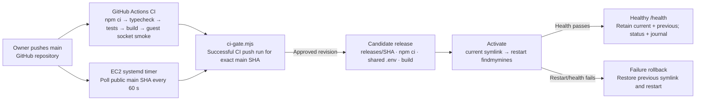

CI runs for pushes and PRs targeting `main`, on Node 22/Ubuntu. The deploy gate
accepts the **push** workflow result for the exact main revision; a green PR run
alone does not authorize deployment. Pending/failed/missing CI does not switch the
running release. The EC2 service pulls from the public repository; GitHub does not
push a deployment into an inbound EC2 port. No GitHub deployment secret is needed
for this public-repository flow.

```text
/home/ubuntu/fmm/
  current -> releases/<verified-sha>/
  releases/<verified-sha>/       application source + built React bundle
    .env -> ../../shared/.env   shared runtime and frontend build settings
  shared/.env                   secret configuration; outside Git
  shared/deploy-status.json     status shown only to authorized admins
```

`flock` prevents overlapping deploys. A narrowly scoped sudoers rule permits the
deployer to restart the app service. The script keeps the three newest releases
while protecting active/previous ones, remembers failed CI revisions and rechecks
them later, and records status in the shared file/systemd journal. Failed restart
or health check rolls back; an application restart still ends live games. The
health check verifies server liveness, not every account/AI integration.

**Sources:** [CI workflow](../.github/workflows/ci.yml),
[release script](../deploy/auto-deploy.sh), [CI gate](../deploy/ci-gate.mjs),
[timer](../deploy/findmymines-deploy.timer),
[service override](../deploy/findmymines.override.conf),
[sudoers rule](../deploy/findmymines-deploy.sudoers).

## 11. LAN assignment demo and alternative hosts

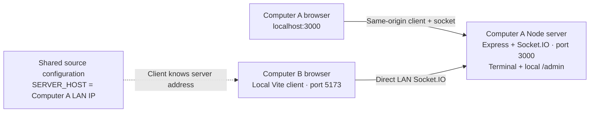

For the graded demo, Computer A runs the server and built client. Computer B runs
only the Vite client; its shared `SERVER_HOST` source constant points to A. Players
enter a nickname, not an IP/port. This demo needs reachable LAN/firewall settings
and no cloud services or credentials for guest play. Development uses Vite on
5173 and the Node server on 3000. The source constants govern development;
production chooses `VITE_SERVER_URL`, then `PUBLIC_SERVER_URL`, then the origin
that served the page.

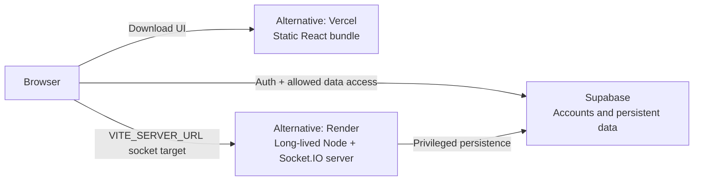

Vercel + Render is the tracked alternative, not an extra layer in the EC2 tunnel
path. [vercel.json](../vercel.json) configures static frontend hosting;
[render.yaml](../render.yaml) configures the persistent server. CORS and auth
redirect URLs must match the chosen origins.
[Dockerfile](../Dockerfile) and [docker-compose.yml](../docker-compose.yml) provide
a separate one-port container option. The documented current EC2 service runs
`npm start` under systemd, not Kubernetes or a required Docker orchestrator.

## 12. Configuration boundaries and architectural limits

| Setting category | Examples | Used where |
|---|---|---|
| Public frontend build settings | `VITE_SUPABASE_URL`, `VITE_SUPABASE_ANON_KEY`, `VITE_SERVER_URL`, `VITE_OAUTH_PROVIDERS` | Vite bakes values into the browser bundle; changing them requires rebuilding |
| Server-only secrets | `SUPABASE_SERVICE_ROLE_KEY`, `ADMIN_TOKEN`, `GROQ_API_KEY`, `GROQ_COACH_API_KEY`, `JEV_API_KEY` | Server process/shared `.env`; never expose through `VITE_*` |
| Nonsecret server settings | `PORT`, `HOST`, `CORS_ORIGIN`, `PUBLIC_URL`, `AI_MODEL`, `JEV_MODEL`, `DEPLOY_STATUS_FILE` | Server configuration; model defaults do not prove those models are connected |
| AWS identity | EC2 instance role and temporary SDK credentials | IMDSv2/AWS SDK; no permanent AWS access key in `.env` |
| Offline data-fetch secret | `NEUPRINT_TOKEN` | Dataset fetch script only; not required by game runtime |

The multiplayer design assumes **one authoritative server process**. There is no
Redis adapter, durable live-game store, multi-instance room coordination or
load-balancer deployment defined here. Adding replicas would require redesigning
room ownership, socket distribution, timers and shared request budgets. Restarts
and deployments interrupt active games; saved completed data survives in Supabase.

Cloudflare cache/WAF rules, database backup schedules, mail delivery configuration,
OAuth dashboard secrets, and actual cloud resource IDs are not established by the
tracked source. The app uses Supabase Auth's configured email/OAuth capabilities,
not a separate in-repository mail service. Domain registration/DNS and tunnel setup
are external configuration, so the hosting diagram is topology rather than a
complete infrastructure-as-code inventory.

### Suggested presentation order

1. Show the whole-system view and distinguish browser, server, and external services.
2. Walk through one move and explain why clients cannot see hidden mines.
3. Show authentication, the two database access paths, and the ER relationships.
4. Explain solver/Groq/JEV/Fruit Fly differences, hint validation and the review coach.
5. Explain data lifetime, admin access, Cloudflare/EC2 and CI rollback.
6. Finish with the LAN setup required by the assignment and the single-server limits.

For deeper design rationale, read [scaffold.md](../scaffold.md). For setup and
commands, use [README.md](../README.md), [CONTRIBUTING.md](../CONTRIBUTING.md),
[DEPLOY.md](../DEPLOY.md) and [deploy/README.md](../deploy/README.md).
